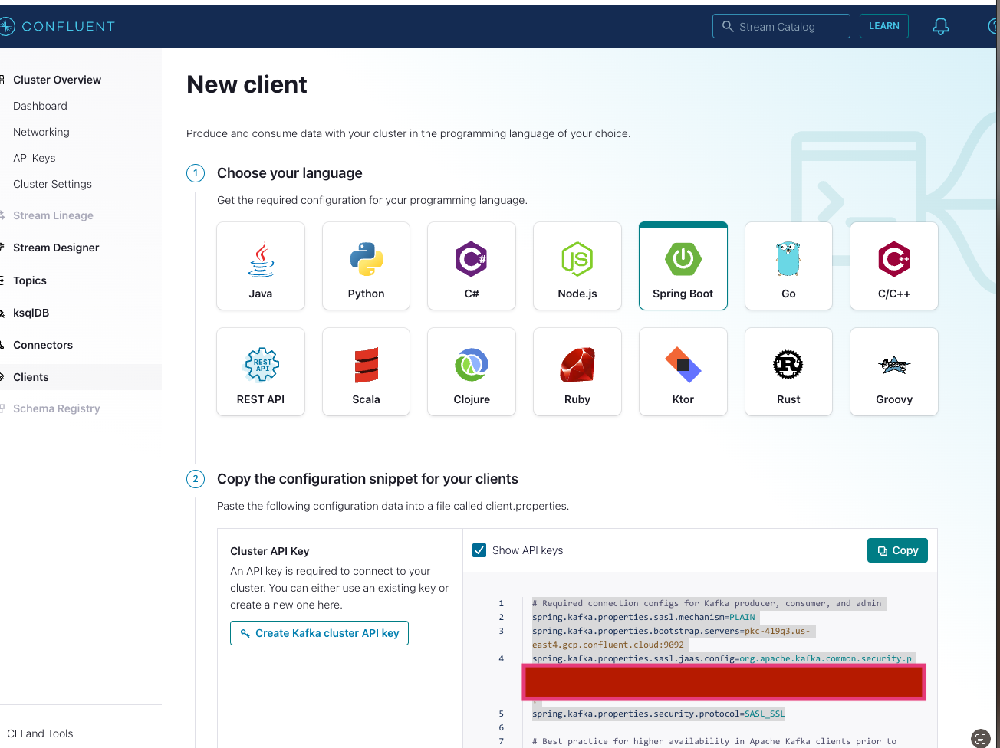

# KafkaSpringBoot

Introduction to Spring Boot for Apache Kafka

Although Spring has been around for more than a decade, it has kept up with the times and embraces the best modern, cloud-native technologies. For example, it supports a modern version of Java and has cross-language options, such as a Kotlin integration. Spring supports the requirements of the Twelve-Factor App manifesto, meaning, for example, that you can move your applications between different environments without changing the code. And Spring also has a large community, with an extensive number of Java and JVM developers currently using it.

Adding the Spring Boot framework to Spring reduces development time and increases overall productivity. Although its opinionated configurations are actually what save you time, Spring Boot also provides the ability to extend or modify certain options if you need to customize or if its opinions don't fit with the requirements of your system.

And Spring Boot comes with a variety of included "batteries,” for example, integrations with databases and messaging systems are included. In fact, virtually any data source you have in a modern application landscape can interact with your Spring code.

This course focuses on the Spring for Apache Kafka project, which extends opinionated options for combining Spring Boot and Kafka. Spring for Apache Kafka is a top-level project that applies the Spring community's existing practices to the Kafka ecosystem. So, for example, the JmsTemplate used with the Java Message Service is manifested in KafkaTemplate, a thin layer on top of the Kafka producer API. Spring for Apache Kafka also has options that ease the configuration of Kafka with Spring Boot, and you can access them programmatically or declaratively using property files.

Generally, Spring for Apache Kafka provides features that abstract away infrastructure code so you can focus on your programming logic. In addition to the KafkaTemplate mentioned above, it provides MessageListenerContainer, which allows Spring to handle low-level communications, including retries and serialization. Spring for Apache Kafka also extends @KafkaListener, an annotation for POJOs that lets you convert a method into a Kafka consumer, and TopicBuilder, which simplifies topic configuration.

But in the end, should you use Spring or no framework at all? It's really a question about your productivity and where you want to spend your time. Spring has built-in ways of configuring applications, and because they are opinionated, they are easy to communicate with other Spring developers.

The goal of this course is to give you the tools to effectively use Spring with Confluent Cloud.
